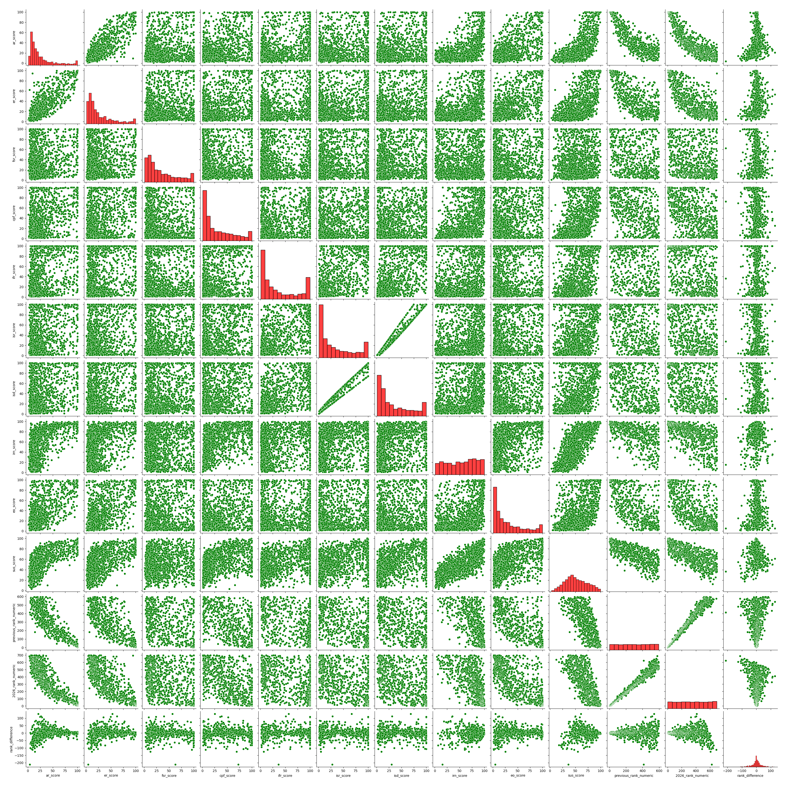
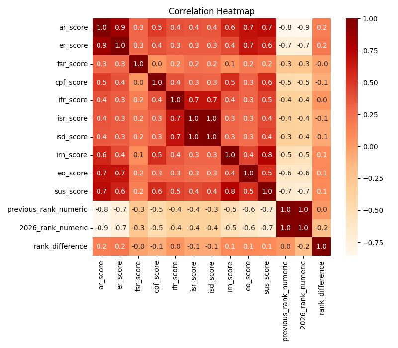
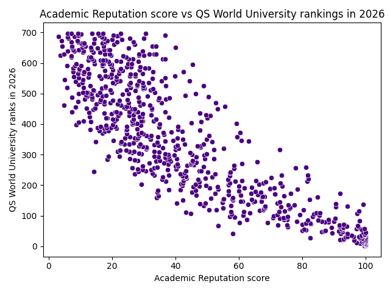
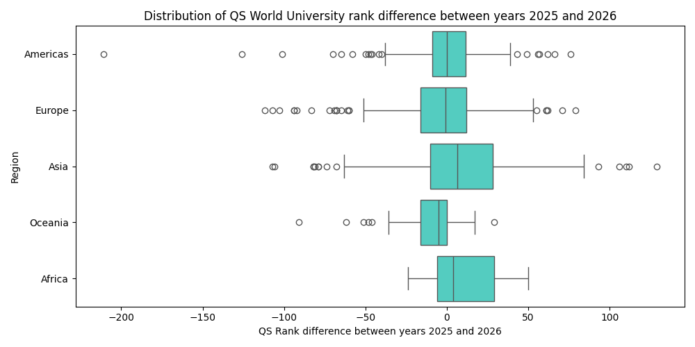
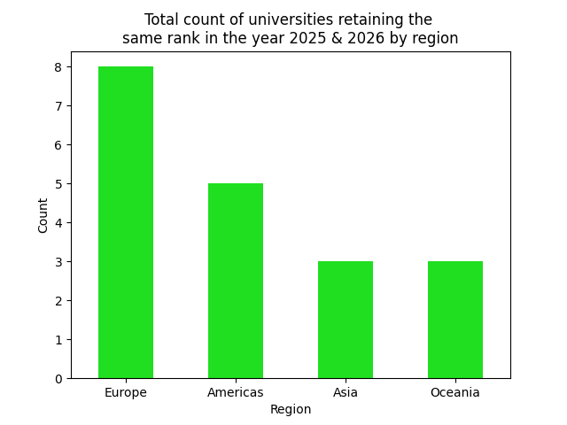
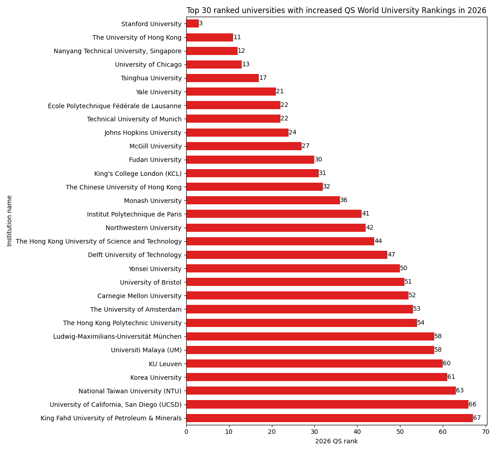
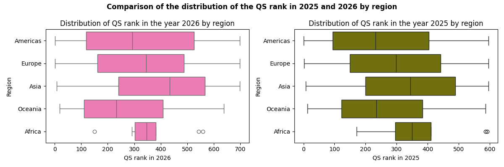
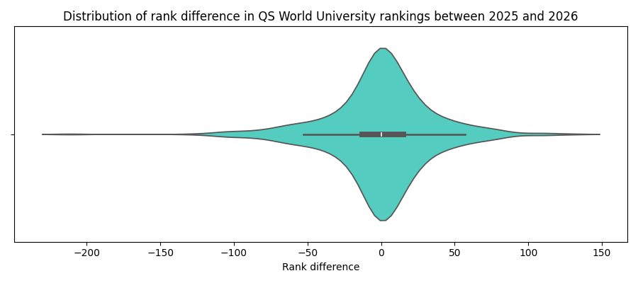
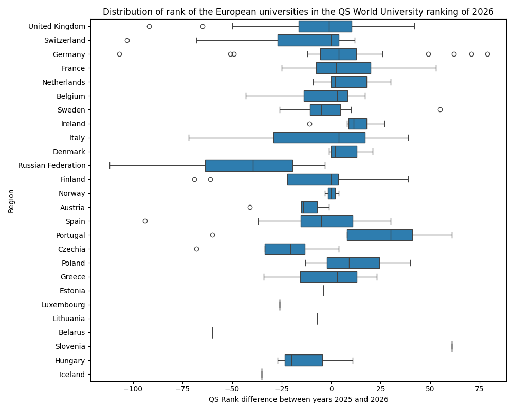

# Data Analysis of QS World University Rankings 2026

  
  
  
  
  

## Dataset
- Source: Kaggle
- Source url: https://www.kaggle.com/datasets/akashbommidi/2026-qs-world-university-rankings
- Size: 1501 rows

## Kaggle Notebook
https://www.kaggle.com/code/reshmaharidhas/eda-of-qs-world-university-ranking-of-2026

## Analysis Workflow💻
- Exploratory Data Analysis (EDA)
- Data cleaning
- Data Visualizations

## Tech stack💻
- Pandas
- Matplotlib
- Seaborn
- Python
- Numpy

## Visualizations

## License💻
MIT
